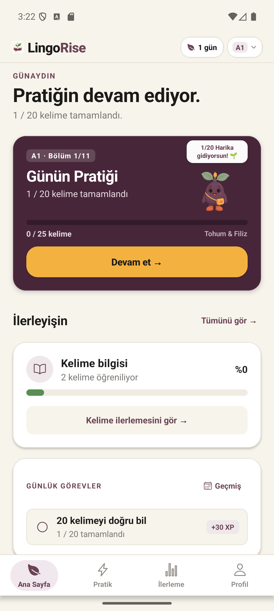
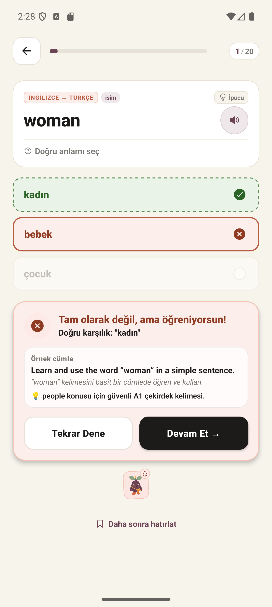
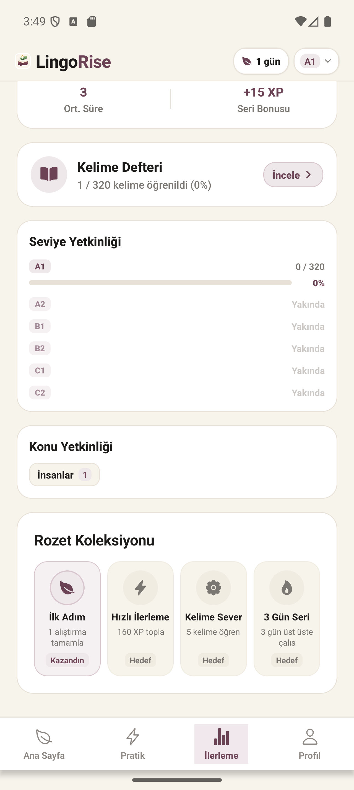

<div align="center">

# 🌱 LingoRise

**Türkçe konuşanlar için, unutmayı ciddiye alan bir İngilizce kelime öğrenme uygulaması.**

[](https://github.com/Krayirhan/lingorise/actions/workflows/ci.yml)


</div>

---

LingoRise, kullanıcıların A1'den C2'ye kadar kelime bilgisini oyunlaştırılmış, aralıklı tekrara (spaced repetition) dayalı bir döngüyle geliştirmesini hedefler. "Bahçe" metaforu — her pekişen kelime bahçeyi büyütür — ilerlemeyi görünür ve dürüst tutmayı amaçlar: **XP çabayı, bahçe ise gerçekten hatırladığını ölçer.**

## 📱 Ekranlar

<table>
<tr>
<td width="33%">

<p align="center"><sub>Ana ekran — bölüm ilerlemesi, günlük görev, bahçe büyümesi</sub></p>
</td>
<td width="33%">

<p align="center"><sub>Pratik oturumu — anlam eşleştirme, anlık geri bildirim</sub></p>
</td>
<td width="33%">

<p align="center"><sub>İlerleme — "görülen" ve "pekişen" kelime ayrı ayrı</sub></p>
</td>
</tr>
</table>

## ✨ Öne çıkan tasarım kararları

Bu proje, klasik bir "kelime kartı" uygulamasından farklı olarak üç ilkeyi katı şekilde ayırıyor:

| İlke | Ne anlama geliyor |
|---|---|
| 🎯 **XP ≠ Bilgi** | XP çabayı ödüllendirir, asla azalmaz. Bir kelimeyi *gerçekten bildiğini* söyleyen ayrı bir eksen var: **mastery**. |
| 📅 **Gerçek aralıklı tekrar** | Bir kelime "pekişmiş" sayılması için **3 ardışık doğru + en az 2 farklı günde** doğru bilinmesi gerekir. Tek oturumda ezberlemek mastery saydırmaz — SM-2 tabanlı bir zamanlayıcı her kelimeyi otomatik olarak yeniden sorar. |
| 🚪 **Kilitsiz, ama kazanılan ilerleme** | Hiçbir seviye kilitli değil — istediğin an istediğin seviyeyi çalışabilirsin. Ama seviye rozeti ancak **%80 mastery** ile kazanılır, ve içerik hazır olmayan seviyeler dürüstçe "Yakında" olarak işaretlenir. |

## 🏗️ Mimari

```
src/
├── domain/              saf iş mantığı — React'tan, Firebase'den bağımsız
│   ├── learning/         mastery türetme, seviye terfi kuralları
│   ├── review/           SM-2 tabanlı aralıklı tekrar zamanlayıcı
│   ├── practice/         bir cevabın XP/mastery/görev üzerindeki etkisi
│   └── gamification/     XP, bahçe evreleri, günlük görev/devir mantığı
├── state/                React hook'ları — oturum ve kullanıcı ilerleme state'i
├── services/             AsyncStorage, Firestore senkron, içerik erişimi
├── features/             ekran bazlı bileşenler (home, practice, progress, profile)
├── content/              kelime havuzu, seviye/ünite bölünmesi
└── i18n/                 TR/EN sözlükler, derleme zamanında tip-güvenli
```

Katmanlar arasındaki sınır bilinçli: `domain/` klasöründeki hiçbir dosya React, Firebase veya AsyncStorage'a bağımlı değil — bu yüzden mastery hesaplaması, SM-2 zamanlaması ve terfi mantığı **tamamen izole birim testleriyle** doğrulanabiliyor.

## 🧪 Kalite

```bash
npm run typecheck   # tsc --noEmit, sıfır hata
npm test            # 177 test, domain mantığının tamamını kapsar
```

Testler; mastery türetme, SM-2 zamanlaması, günlük devir, seviye terfi kapısı, çoklu cihaz senkron birleştirmesi ve eski veri göçü senaryolarını kapsıyor — hiçbiri gerçek zaman veya gerçek ağ bağlantısı gerektirmiyor.

## 🚀 Başlarken

Node.js 20+ ve Expo Go kurulu bir mobil cihaz/emülatör gerekir.

```bash
npm install
npm start
```

Terminaldeki QR kodu Expo Go ile tarayın veya `a` (Android), `i` (iOS) tuşlarını kullanın.

```bash
npm run android              # Android emülatörde native build
npm run typecheck            # Tip kontrolü
npm test                     # Domain testleri
npm run test:e2e:smoke       # Maestro ile uçtan uca duman testi
npm run build:android:preview   # EAS ile önizleme APK'sı
```

`.env.example` dosyasını `.env` olarak kopyalayıp Firebase proje bilgilerinizi girin.

## 📚 Dokümantasyon

### Ürün ve tasarım
- [Ürün Vizyonu](docs/01-product-vision.md) · [Oyun Tasarım Dokümanı](docs/02-game-design-document.md) · [Kullanıcı Profilleri ve Akışları](docs/03-user-personas-and-user-flows.md)
- [Seviye Sistemi](docs/04-level-system.md) · [Oyun Modları](docs/05-game-modes.md) · [Soru Tipleri](docs/06-question-types.md)
- [Müfredat ve Kelime Sistemi](docs/07-curriculum-and-vocabulary.md) · [İçerik ve Metin Kuralları](docs/14-content-and-copy-rules.md)
- [UI Sistemi](docs/12-ui-system.md) · [Görsel Yenileme Planı](docs/16-visual-refresh-plan.md)

### Mimari
- [Teknik Mimari](docs/10-technical-architecture.md) · [Güncel ve Hedef Mimari](docs/13-current-and-target-architecture.md)
- [MVP Uygulama Planı](docs/11-mvp-implementation-plan.md) · [MVP Kapsam Kilidi](docs/15-mvp-scope-lock.md)
- [Learning Garden Ürün Kuralı](docs/17-lingorise-learning-garden-product-rule.md)

### 🗺️ Bitirme Yol Haritası
İlerleme sisteminin mimarisi kuruldu ama içerik derinliği, parametre kalibrasyonu ve telemetri gibi alanlarda hâlâ iş var. Kalan çalışma **13 dosyaya** bölünmüş, önceliklendirilmiş bir plan olarak belgelendi:

➡️ **[docs/roadmap/00-INDEX.md](docs/roadmap/00-INDEX.md)** — tam yol haritası, öncelik sırası ve bağımlılık haritası

| Birim | Durum |
|---|---|
| İçerik Genişletme (A2-C2) | 🔴 P0 — kritik yol |
| Çok Günlü Doğrulama Altyapısı | 🔴 P0 |
| Telemetri ve Analitik | 🔴 P0 |
| Parametre Doğrulaması | 🟡 P1 |
| SRS Algoritması v2 | 🟡 P2 |
| Erişilebilirlik | 🟡 P1 |
| [Tüm birimler →](docs/roadmap/00-INDEX.md) | |

## 🛠️ Teknoloji

React Native · Expo SDK 56 · TypeScript (strict) · Firebase (Auth, Firestore) · AsyncStorage
